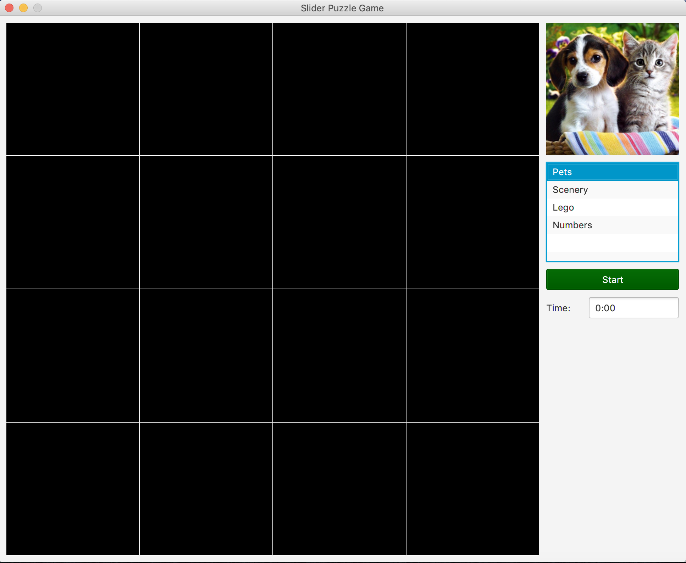
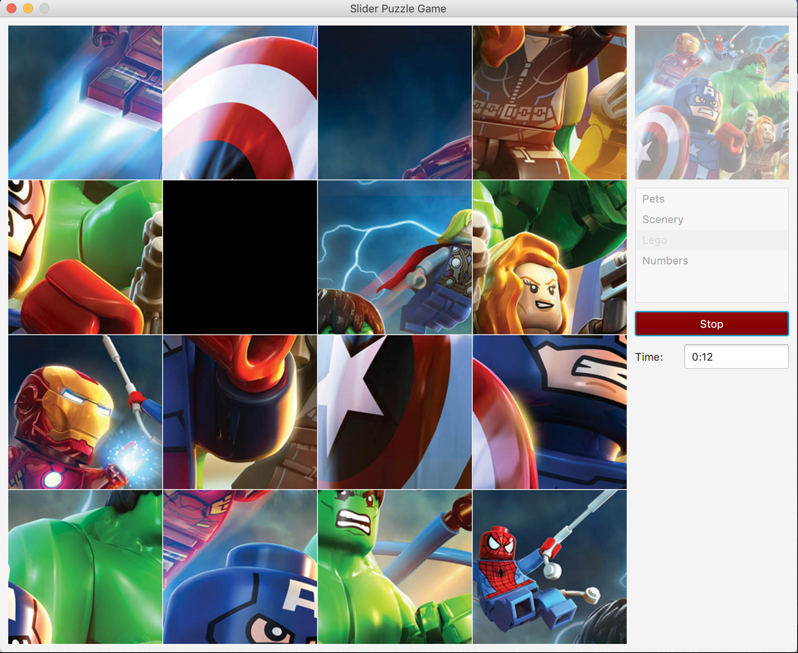

# Project Name

Sliding Puzzle Game

# Purpose

Using JavaFX, this was one of the GUI assignments that I completed for Introduction to Computer Science II (COMP 1406) at Carleton University. This program is a slider puzzle game; users move pieces of a puzzle around with the goal of re-creating the original image in order to complete/win the game; the design and features were implemented according to assignment specifications.

# Operating Instructions

When the program is run:
- the user can select which image they'd like to use for their puzzle from the options on the top right
- once a selection is made, the user can click the start button to begin the game
- a piece of the original image is randomly removed and the remaining pieces are shuffled and placed onto the game board
- the user can click the piece they'd like to shift to the blank space
- once the image is re-shaped into its original appearance, the missing piece is inserted into the blank space to form the complete original image and the timer stops

# Screenshots
- Upon starting:

- After starting a game (with the Lego puzzle option):

